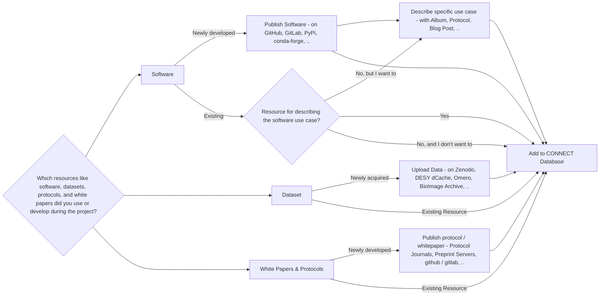

## Helmholtz Imaging Solutions


Solutions are puzzle pieces to successful scientific stories along the imaging pipeline. This includes resources developed and acquired by Helmholtz researchers, but also best practices for utilizing resources from scientific imaging communities worldwide.


- Developed by the **Helmholtz Imaging team** and the **community**
- Include **software**, **datasets**, **protocols**, and **whitepapers**
- Support imaging research **across all domains**

### Where to find solutions?

**[https://connect.helmholtz-imaging.de/solution](https://connect.helmholtz-imaging.de)**

---

## Helmholtz Imaging Solutions on CONNECT



---

## How to add a Helmholtz Imaging Solution

1. **Upload your solution resources** or collect existing resources.
   - **Submit software tools**: Have you developed software tools that can be shared?
   - **Share datasets**: Can your datasets be made available to others?
   - **Publish protocols and white papers**: Have you published white papers or protocols or any other form of 
     workflow documentation?
2. Add all solution links to the **CONNECT Database**.

---

## Where to upload your resources
### Software



| **Repository**                                         | **Advantages**                                         |
|-------------------------------------------------------------------|--------------------------------------------------------|
| [**Helmholtz Codebase**](https://gitlab.hzdr.de/)                                 | - Gitlab instance available for anyone with a Helmholtz Center Login. |
| [**GitLab**](https://gitlab.com/)                                 | - Built-in CI/CD pipelines. - Comprehensive project management. - Supports self-hosting. |
| [**GitHub**](https://github.com/)                                 | - Largest developer community. - Easy collaboration. - Integration with Zenodo for DOIs. |
| [**Zenodo**](https://zenodo.org/)                                 | - Free archival with DOI assignment. - Integrates with GitHub. - Open access to datasets and software. |
| [**SourceForge**](https://sourceforge.net/)                       | - Established platform for open-source. - Project management tools. - Wide visibility for research projects. |



---

## Where to upload your resources
### Image Datasets Across Domains


| **Repository**                                      | **Advantages**                                                                                          |
|----------------------------------------------------------------|---------------------------------------------------------------------------------------------------------|
| [**InfiniteSpace / dCache**](https://hifis.net/doc/cloud-services/Storage_DESY/)         | - Unlimited storage for projects within Helmholtz. -Access through Helmholtz ID. - Data HTTP - streamable.  |
| [**Kaggle Datasets**](https://www.kaggle.com/datasets)         | - Diverse datasets across disciplines. - Active community and competitions. - User-friendly tools. |
| [**Open Science Framework (OSF)**](https://osf.io/)           | - Multidisciplinary support. - Collaboration and project management. - Promotes open access.      |
| [**Open Images Dataset**](https://storage.googleapis.com/openimages/web/index.html) | - Millions of annotated images. - Rich annotations (bounding boxes, segmentation). - Regular updates. |
| [**Figshare**](https://figshare.com/)                           | - Supports various data types. - Easy sharing with privacy options. - DOI for citation.           |
| [**Zenodo**](https://zenodo.org/)                               | - Free and open access. - GitHub integration. - Assigns DOIs for datasets.                       |



---

## Where to upload your resources
### Image Datasets in Health



| **Repository**                                      | **Advantages**                                                                                          |
|----------------------------------------------------------------|---------------------------------------------------------------------------------------------------------|
| [**The Cancer Imaging Archive (TCIA)**](https://www.cancerimagingarchive.net/) | - Extensive cancer-related images. - High-quality annotations. - Supports clinical research.       |
| [**BioImage Archive**](https://www.ebi.ac.uk/bioimage-archive/) | - Focused on biological images. - Standardized data formats. - Integrates with EBI resources.     |
| [**ICPSR**](https://www.icpsr.umich.edu/web/pages/) | - Extensive health and social science data. - Secure data submission with access controls. - Comprehensive metadata support. |
| [**BioStudies**](https://www.ebi.ac.uk/biostudies/) | - Focused on biological and medical research. - Integrates with other EBI resources. - Supports a wide range of data types. |



---

## Where to upload your resources
### Image Datasets in Earth & Environment



| **Repository**                                      | **Advantages**                                                                                          |
|----------------------------------------------------------------|---------------------------------------------------------------------------------------------------------|
| [**PANGAEA**](https://www.pangaea.de/)               | - Specialized for georeferenced data. - Long-term data preservation. - Comprehensive metadata standards. |
| [**Earthdata**](https://earthdata.nasa.gov/)         | - Integration with NASA’s Earth observation data. - Scalable storage solutions. - Robust data validation tools. |
| [**GBIF**](https://www.gbif.org/)                    | - Focused on biodiversity data. - Global accessibility. - Supports large-scale data submissions. |



---

## Where to upload your resources
### Image Datasets in Energy



| **Repository**                                      | **Advantages**                                                                                          |
|----------------------------------------------------------------|---------------------------------------------------------------------------------------------------------|
| [**OpenEI**](https://openei.org/)                 | - Focused on renewable energy data. - Collaborative platform with community contributions. - Integration with energy modeling tools. |
| [**International Energy Agency (IEA) Data**](https://www.iea.org/data-and-statistics) | - Comprehensive energy statistics. - High-quality data curation. - Facilitates policy-relevant research. |


---

## Where to upload your resources
### Image Datasets in Aeronautics & Space



| **Repository**                                      | **Advantages**                                                                                          |
|----------------------------------------------------------------|---------------------------------------------------------------------------------------------------------|
| [**NASA's Planetary Data System (PDS)**](https://pds.nasa.gov/) | - Specialized for planetary science data. - Robust data archiving and curation. - Ensures data accessibility for future research. |
| [**OpenSky Network**](https://opensky-network.org/)   | - Specialized for aviation data. - Real-time and historical flight data. - Facilitates research in air traffic management and safety. |


---

## Where to upload your resources
### Image Datasets in Matter



| **Repository**                                      | **Advantages**                                                                                          |
|----------------------------------------------------------------|---------------------------------------------------------------------------------------------------------|
| [**Materials Data Facility (MDF)**](https://www.materialsdatafacility.org/) | - Specialized for materials science data. - Supports large-scale data uploads. - Facilitates data sharing and collaboration. |
| [**NanoHub**](https://nanohub.org/)               | - Dedicated to nanotechnology data. - Supports simulation and experimental data uploads. - Provides computational tools for data analysis. |


---

## Where to upload your resources
### White Papers and Protocols


Documenting methodologies and sharing best practices is vital for advancing imaging science. 
**White Papers** contribute to scientific knowledge and best practices. **Protocols** provide detailed methods for 
replication and validation.


### Where to publish



| **Repository**          | **Advantages**                                       |
|------------------------------------|------------------------------------------------------|
| [**arXiv**](https://arxiv.org/)     | - Widely recognized preprint server. - Covers multiple disciplines. - Fast dissemination of research. |
| [**bioRxiv**](https://www.biorxiv.org/) | - Focused on biological sciences. - Enhances visibility within the biology community. - Rapid publication process. |
| [**protocols.io**](https://www.protocols.io/) | - Specialized for research protocols. - Easy version control. - Community feedback and sharing. |



---

## Related services of the Helmholtz Information and Data Science Platforms 

Researchers working at Helmholtz can contact our sister platforms regarding the following topics: 

- [Contact HIFIS](https://hifis.net/contact.html) for software development questions, for 
  example regarding FAIR principles, code refactoring, or  cloud computing.
- [Contact HMC](https://helmholtz-metadaten.de/en/hmc-helpdesk) for metadata related questions.
- [Consult Helmholtz AI](https://www.helmholtz.ai/you-helmholtz-ai/ai-consulting/) for AI related method development.
- [Check out the HIDA Course Catalog](https://www.helmholtz-hida.de/course-catalog/en/) for data science related 
  trainings.

---

## Adding Solution to CONNECT

### 1. Visit **[connect.helmholtz-imaging.de](https://connect.helmholtz-imaging.de)** and click on *Login*.



---

## Adding Solution to CONNECT

### 2. Login using your Helmholtz ID.



---

## Adding Solution to CONNECT

### 3. Click on *Add Data*.



---

## Adding Solution to CONNECT

### 4. Under *Solutions*, click on *Add Solution*.



---

### Flowchart

{{ <hidden> }}

---

## Questions?


Feel free to reach out if you have any questions or need assistance with contributing to Helmholtz Imaging Solutions.


- **Contact Us**: [support@helmholtz-imaging.de](mailto:support@helmholtz-imaging.de)
- **Visit**: [helmholtz-imaging.de](https://helmholtz-imaging.de)
