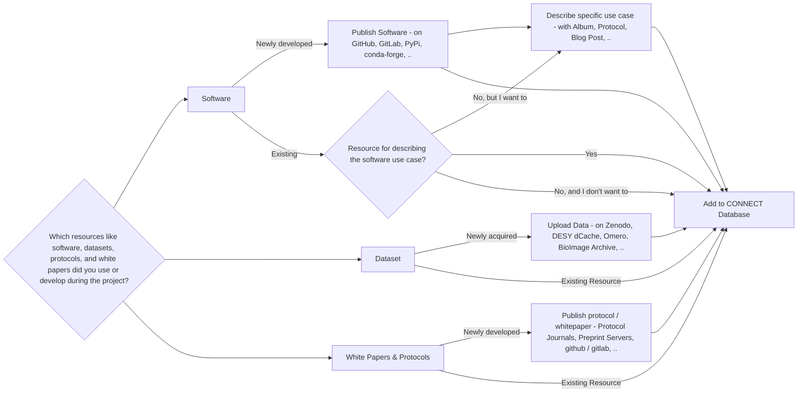

## Helmholtz Imaging Solutions





Solutions are puzzle pieces to successful scientific stories along the imaging pipeline. This includes resources developed and acquired by Helmholtz researchers, but also best practices for utilizing resources from scientific imaging communities worldwide.


- Developed by the **Helmholtz Imaging team** and the **community**
- Include **software**, **datasets**, **protocols**, and **whitepapers**
- Support imaging research **across all domains**

### Where to find solutions?

**[https://connect.helmholtz-imaging.de](https://connect.helmholtz-imaging.de)**







---

## Helmholtz Imaging Solutions on CONNECT

TODO statistics, examples

---

## How to add Helmholtz Imaging Solutions

1. **Upload your solution resources** or collect existing resources
   - **Submit doftware tools**: Have you developed software tools that can be shared?
   - **Share datasets**: Can your datasets be made available to others?
   - **Publish protocols and white papers**: Have you published white papers or protocols or any other form of 
     workflow documentation?
2. Add all solution links to **CONNECT Database**

---

## Upload your resources
### Software

| **Repository Name & URL**                                         | **Advantages**                                         |
|-------------------------------------------------------------------|--------------------------------------------------------|
| [**GitHub**](https://github.com/)                                 | - Largest developer community. - Easy collaboration. - Integration with Zenodo for DOIs. |
| [**GitLab**](https://gitlab.com/)                                 | - Built-in CI/CD pipelines. - Comprehensive project management. - Supports self-hosting. |
| [**Zenodo**](https://zenodo.org/)                                 | - Free archival with DOI assignment. - Integrates with GitHub. - Open access to datasets and software. |
| [**SourceForge**](https://sourceforge.net/)                       | - Established platform for open-source. - Project management tools. - Wide visibility for research projects. |

---

## Upload your resources
### Datasets (across domains)

| **Repository**                                      | **Advantages**                                                                                          |
|----------------------------------------------------------------|---------------------------------------------------------------------------------------------------------|
| [**Kaggle Datasets**](https://www.kaggle.com/datasets)         | - Diverse datasets across disciplines. - Active community and competitions. - User-friendly tools. |
| [**Open Science Framework (OSF)**](https://osf.io/)           | - Multidisciplinary support. - Collaboration and project management. - Promotes open access.      |
| [**Open Images Dataset**](https://storage.googleapis.com/openimages/web/index.html) | - Millions of annotated images. - Rich annotations (bounding boxes, segmentation). - Regular updates. |
| [**Figshare**](https://figshare.com/)                           | - Supports various data types. - Easy sharing with privacy options. - DOI for citation.           |
| [**Zenodo**](https://zenodo.org/)                               | - Free and open access. - GitHub integration. - Assigns DOIs for datasets.                       |

---

## Upload your resources
### Datasets (BioImaging)

| **Repository**                                      | **Advantages**                                                                                          |
|----------------------------------------------------------------|---------------------------------------------------------------------------------------------------------|
| [**The Cancer Imaging Archive (TCIA)**](https://www.cancerimagingarchive.net/) | - Extensive cancer-related images. - High-quality annotations. - Supports clinical research.       |
| [**BioImage Archive**](https://www.ebi.ac.uk/bioimage-archive/) | - Focused on biological images. - Standardized data formats. - Integrates with EBI resources.     |

---

## Upload your resources
### White Papers and Protocols


Documenting methodologies and sharing best practices is vital for advancing imaging science.


- **White Papers**:
  - Contribute to scientific knowledge and best practices.
- **Protocols**:
  - Provide detailed methods for replication and validation.

### Where to publish

- **Open Access Journals**: Publish your white papers in journals supporting open science.
- **Preprint Servers**: Share preliminary findings on platforms like **arXiv** or **bioRxiv**.
- **Protocol Repositories**: Use platforms like **protocols.io** for sharing detailed protocols.
  
---

## Adding Solution to CONNECT

### 1. Visit **[connect.helmholtz-imaging.de](https://connect.helmholtz-imaging.de)** and click on *Login*.



---

## Adding Solution to CONNECT

### 2. Login using your Helmholtz ID.



---

## Adding Solution to CONNECT

### 3. Click on *Add Data*.



---

## Adding Solution to CONNECT

### 4. Under *Solutions*, click on *Add Solution*.



---

### Flowchart

{{ <hidden> }}

---

## Questions?


Feel free to reach out if you have any questions or need assistance with contributing to Helmholtz Imaging Solutions.


- **Contact Us**: [support@helmholtz-imaging.de](mailto:support@helmholtz-imaging.de)
- **Visit**: [helmholtz-imaging.de](https://helmholtz-imaging.de)
