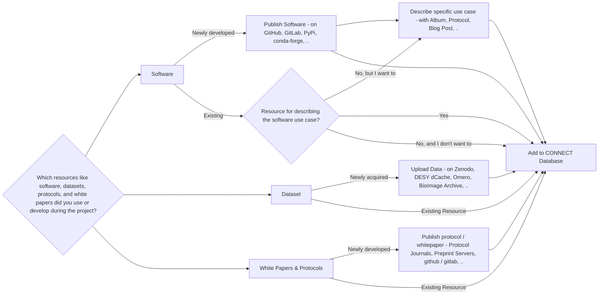

## Helmholtz Imaging Solutions


Solutions are puzzle pieces to successful scientific stories along the imaging pipeline. This includes resources developed and acquired by Helmholtz researchers, but also best practices for utilizing resources from scientific imaging communities worldwide.


- Developed by the **Helmholtz Imaging team** and the **community**
- Include **software**, **datasets**, **protocols**, and **whitepapers**
- Support imaging research **across all domains**

### Where to find solutions?

**[https://connect.helmholtz-imaging.de/solution](https://connect.helmholtz-imaging.de)**

---

## Helmholtz Imaging Solutions on CONNECT



---

## How to add a Helmholtz Imaging Solution

1. **Upload your solution resources** or collect existing resources.
   - **Submit software tools**: Have you developed software tools that can be shared?
   - **Share datasets**: Can your datasets be made available to others?
   - **Publish protocols and white papers**: Have you published white papers or protocols or any other form of 
     workflow documentation?
2. Add all solution links to the **CONNECT Database**.

---

## Where to upload your resources
### Software



---

## Where to upload your resources
### Image Datasets Across Domains


---

## Where to upload your resources
### Image Datasets in Health



---

## Where to upload your resources
### Image Datasets in Earth & Environment



---

## Where to upload your resources
### Image Datasets in Energy



---

## Where to upload your resources
### Image Datasets in Aeronautics, Space, and Transport



---

## Where to upload your resources
### Image Datasets in Matter



---

## Where to upload your resources
### White Papers and Protocols


Documenting methodologies and sharing best practices is vital for advancing imaging science. 
**White Papers** contribute to scientific knowledge and best practices. **Protocols** provide detailed methods for 
replication and validation.




---

## Related services of the Helmholtz Information and Data Science Platforms 

Researchers working at Helmholtz can contact our sister platforms regarding the following topics: 

- [Contact HIFIS](https://hifis.net/contact.html) for software development questions, for 
  example regarding FAIR principles, code refactoring, or  cloud computing.
- [Contact HMC](https://helmholtz-metadaten.de/en/hmc-helpdesk) for metadata related questions.
- [Consult Helmholtz AI](https://www.helmholtz.ai/you-helmholtz-ai/ai-consulting/) for AI related method development.
- [Check out the HIDA Course Catalog](https://www.helmholtz-hida.de/course-catalog/en/) for data science related 
  trainings.

---

## Adding Solution to CONNECT

### 1. Visit **[connect.helmholtz-imaging.de](https://connect.helmholtz-imaging.de)** and click on *Login*.



---

## Adding Solution to CONNECT

### 2. Login using your Helmholtz ID.



---

## Adding Solution to CONNECT

### 3. Click on *Add Data*.



---

## Adding Solution to CONNECT

### 4. Under *Solutions*, click on *Add Solution*.



---

### Flowchart

{{ <hidden> }}

---

## Questions?


Feel free to reach out if you have any questions or need assistance with contributing to Helmholtz Imaging Solutions.


- **Contact Us**: [support@helmholtz-imaging.de](mailto:support@helmholtz-imaging.de)
- **Visit**: [helmholtz-imaging.de](https://helmholtz-imaging.de)
